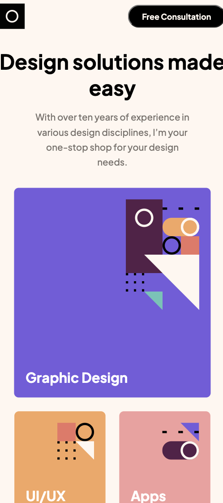
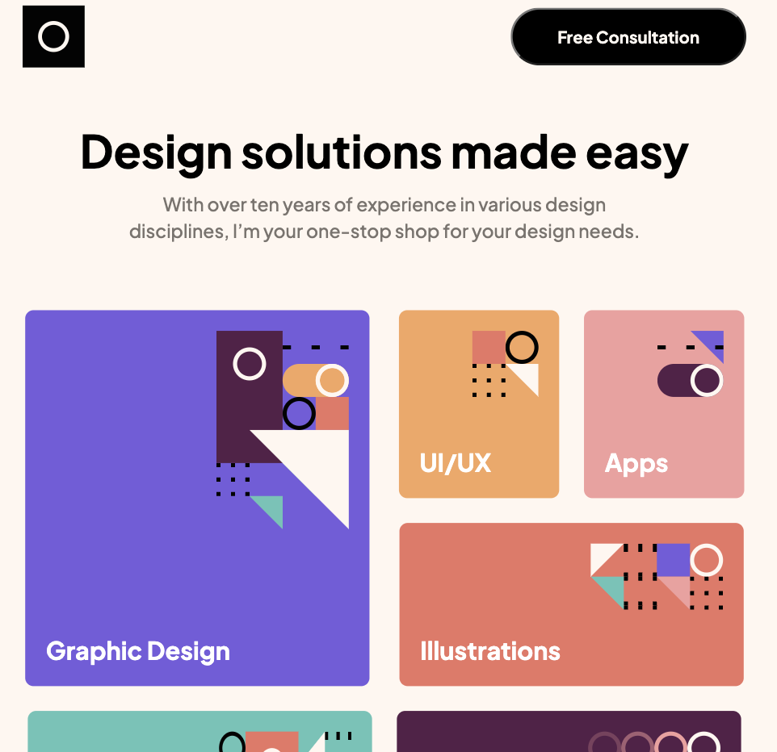
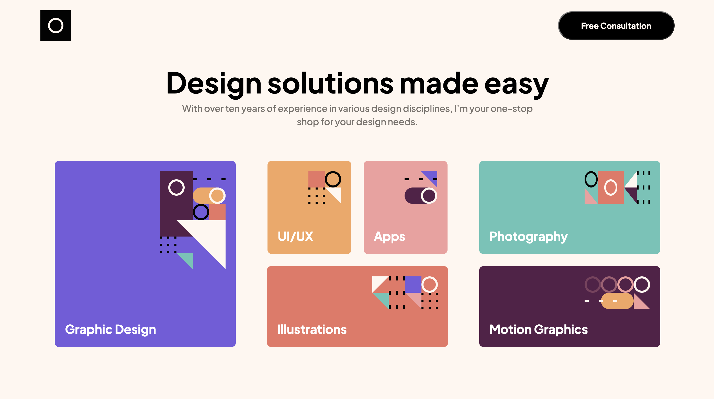

# Frontend Mentor - Single-page design portfolio solution

## Overview

This is a solution to the [Single-page design portfolio challenge on Frontend Mentor](https://www.frontendmentor.io/challenges/singlepage-design-portfolio-2MMhyhfKVo). Frontend Mentor challenges help you improve your coding skills by building realistic projects. 

## Table of contents

  - [The challenge](#the-challenge)
  - [Screenshot](#screenshot)
  - [Links](#links)
  - [Built with](#built-with)
  - [What I learned](#what-i-learned)
  - [Continued development](#continued-development)
- [Author](#author)

### The challenge

Users should be able to:

- View the optimal layout for the site depending on their device's screen size
- See hover states for all interactive elements on the page
- Navigate the slider using either their mouse/trackpad or keyboard

### Screenshot

### Links

- Solution URL: [Add solution URL here](https://your-solution-url.com)
- Live Site URL: [Github deployed page](https://isaaccna.github.io/portfolio-challenge/)

### Built with

- Semantic HTML5 markup
- CSS custom properties
- Flexbox
- Mobile-first workflow

### What I learned

I learned how to setup a slideshow by using html and javascript, and navigate it using either the arrow buttons and the keyboard.

### Continued development

I'd like to update the slideshow. It doesn't look exactly like the mockup page on figma. I want to be able to display a part of both the previous and the next image of the slideshow.

## Author

- Github - [Isaaccna](https://github.com/Isaaccna)
- Frontend Mentor - [@Isaaccna](https://www.frontendmentor.io/profile/Isaaccna)

